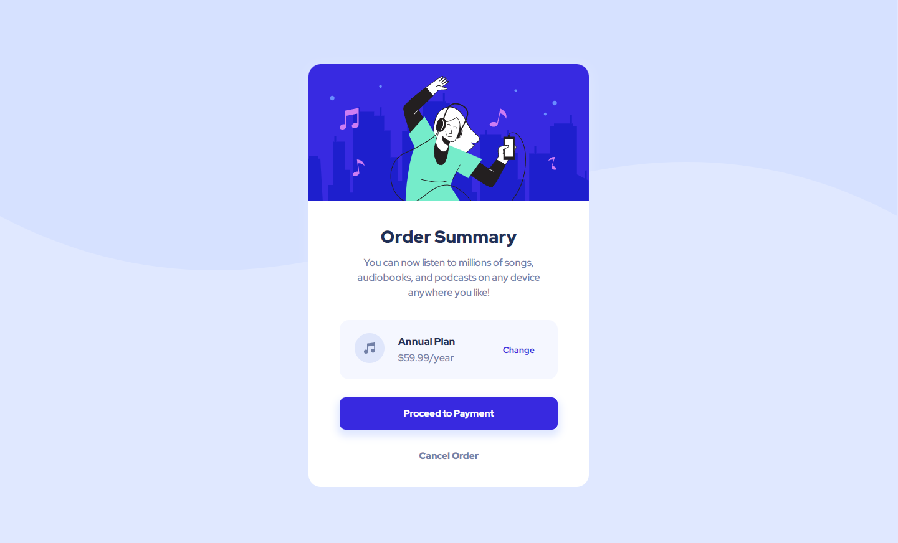

# Frontend Mentor - Order summary card solution

This is a solution to the [Order summary card challenge on Frontend Mentor](https://www.frontendmentor.io/challenges/order-summary-component-QlPmajDUj). Frontend Mentor challenges help you improve your coding skills by building realistic projects. 

## Table of contents

- [Overview](#overview)
  - [The challenge](#the-challenge)
  - [Screenshot](#screenshot)
  - [Links](#links)
- [My process](#my-process)
  - [Built with](#built-with)
  - [What I learned](#what-i-learned)
  - [Continued development](#continued-development)
  - [Useful resources](#useful-resources)
- [Author](#author)
- [Acknowledgments](#acknowledgments)

## Overview

### The challenge

Users should be able to:

- See hover states for interactive elements

### Screenshot

### Links

- Solution URL: [Add solution URL here](https://your-solution-url.com)
- Live Site URL: [Add live site URL here](https://your-live-site-url.com)

## My process

### Built with

- Semantic HTML5 markup
- CSS custom properties
- Flexbox
- CSS Grid
- Mobile-first workflow
- [Sass](https://sass-lang.com/) - CSS extension language
- [Bem](http://getbem.com/) - CSS naming convention

### What I learned

During this project, I practice a bit more about Bem, a CSS naming covention and SASS as an extension language

### Continued development

In my next project i plan to keep using SASS and BEM, but using them together with webpack or some another module bundler

### Useful resources

- [GetBem, Bem Documentation](http://getbem.com/introduction/) - This helped me for understand better how bem works
- [Sass, Documentation](https://sass-lang.com/) - This is the documentation to SASS he helped me for understand what i could do and what i shouldn't do

## Author

- Frontend Mentor - [@Otavio-Cipriano](https://www.frontendmentor.io/profile/Otavio-Cipriano)
- Twitter - [@OtavioDv](https://www.twitter.com/OtavioDv)
- Github - [@Otavio-Cipriano](https://github.com/Otavio-Cipriano/)

